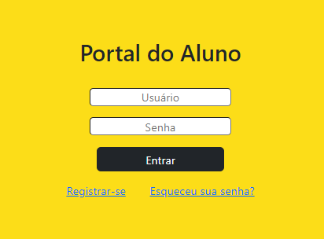
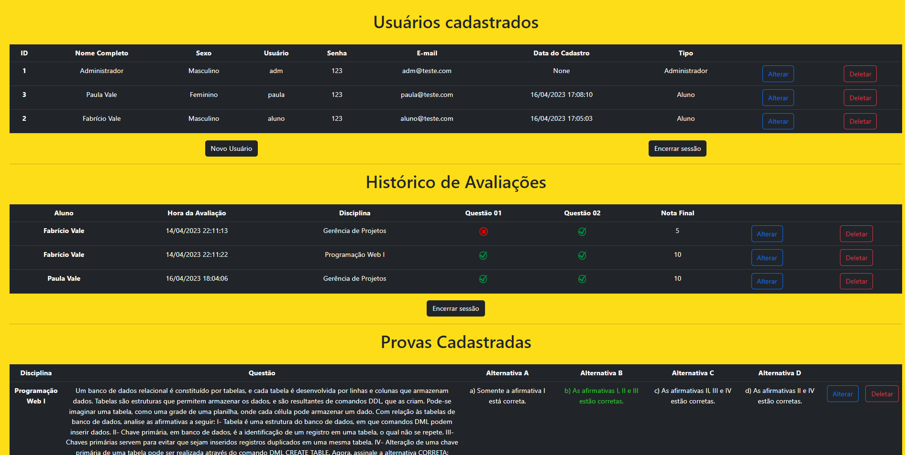
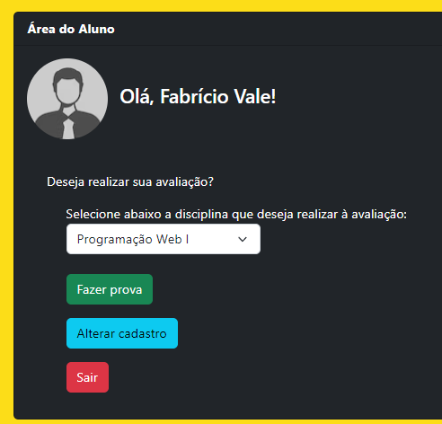

# Aplicação Web

## Cadastro de Alunos UNIASSELVI

Ferramentas:
- Python (Versão 3.10.4)
- Git (Sistema de Controle)
- VSCode (IDE)
- MySQL (Servidor local)

Bibliotecas:
- Gunicorn
- psycopg2

Framework:
- Flask

Outros:
- HTML
- CSS
- BootStrap

# Página Inicial

# Página Administrador

# Página do Aluno
